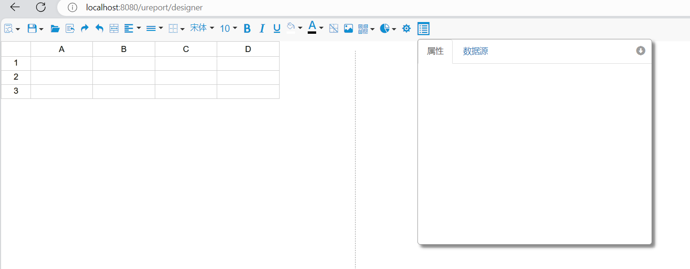

# 简介

UReport3是一款高性能的架构在Spring之上纯Java报表引擎，通过迭代单元格可以实现任意复杂的中国式报表。  
在UReport3中，提供了全新的基于网页的报表设计器，可以在Chrome、Firefox、Edge等各种主流浏览器运行（IE浏览器除外）,打开浏览器即可完成各种复杂报表的设计制作。

UReport3是第一款基于Apache-2.0协议开源的中式报表引擎。

UReport2原仓库2023年11月已停止更新和维护，需要使用jdk17的项目就不能使用原项目依赖，UReport3是在原来的仓库基础上进行修改的，使其兼容jdk17，spring6.2.11,并对其中的依赖进行升级。

# 使用方式

需要下载本仓库源码，并使用maven进行构建打包到本地仓库中，然后使用maven进行依赖引入。安装打包顺序：1. 构建ureport-parent 2. 构建ureport-core 3. 构建ureport-font 4. 构建ureport-console

# Springboot3.X集成UReport3
1. pom.xml
```xml
<dependency>
    <groupId>com.bstek.ureport</groupId>
    <artifactId>ureport3-console</artifactId>
    <version>3.0.1</version>
</dependency>
```
2. application.yml
```yml
#ureport配置
ureport:
  disableHttpSessionReportCache: false
  disableFileProvider: false
  #设计报表源文件存储位置
  fileStoreDir: d://upload/ureport/template
  debug: true
```
3. 配置类
```java
package org.dromara.web.config;

import java.sql.Connection;
import java.sql.SQLException;

import jakarta.servlet.Servlet;
import javax.sql.DataSource;

import com.bstek.ureport.console.UReportServlet;
import com.bstek.ureport.definition.datasource.BuildinDatasource;
import lombok.extern.slf4j.Slf4j;
import org.springframework.beans.factory.annotation.Autowired;
import org.springframework.boot.web.servlet.ServletRegistrationBean;
import org.springframework.context.annotation.Bean;
import org.springframework.context.annotation.Configuration;
import org.springframework.context.annotation.ImportResource;

/**
 * UReport 配置
 * 2026年1月7日
 */
@Slf4j
@Configuration
@ImportResource("classpath:ureport-console-context.xml")
public class UreportConfig implements BuildinDatasource {


    @Autowired
    private DataSource dataSource;
    @Bean
    public ServletRegistrationBean<Servlet> buildUreportServlet(){
        return new ServletRegistrationBean<>(new UReportServlet(), "/ureport/*");
    }

    /**
     * 数据源名称
     **/
    @Override
    public String name() {
        return "内置数据源";
    }

    /**
     * 获取连接
     **/
    @Override
    public Connection getConnection() {
        try {
            return dataSource.getConnection();
        } catch (SQLException e) {
            throw new RuntimeException("获取数据源连接失败", e);
        }
    }
}

```
4. 访问地址
http://ip:port/ureport/designer


# 详细配置

与原来的一样，具体请参考：https://www.w3cschool.cn/ureport。


